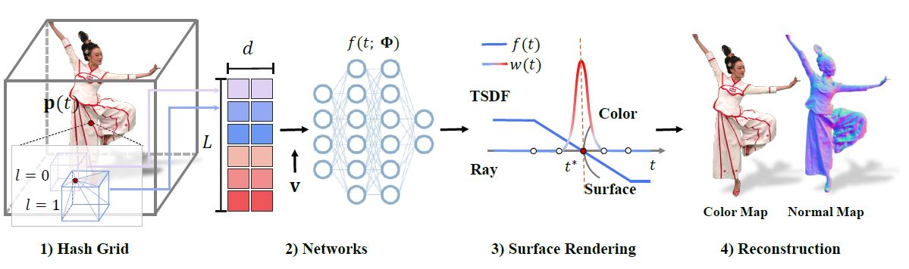

# Instant-NSR (Pytorch)

A Pytorch implementation of __Instant-NSR__, fast surface reconstructor as described in [__Human Performance Modeling and Rendering via Neural Animated Mesh__](https://arxiv.org/pdf/2209.08468.pdf).

> __Human Performance Modeling and Rendering via Neural Animated Mesh__  
> _ACM Transactions on Graphics (__SIGGRAPH Asia 2022__)_  
> __[Project page](https://zhaofuq.github.io/NeuralAM/)&nbsp;/ [Paper](https://arxiv.org/pdf/2209.08468.pdf)&nbsp;/ [Video](https://www.youtube.com/watch?v=k6cmr8HVHrQ)__

 
Based on dense multi-view input, our approach enables efficient and high-quality reconstruction, compression, and rendering of human performances. It supports 4D photo-real content playback for various immersive experiences of human performances in virtual and augmented reality.

This repo helps us to reconstruct 3D models from multi-view images in ~10 mins. Free to run our code!


# Install

First, you need to set training 
```bash
pip install -r requirements.txt

# (optional) install the tcnn backbone
pip install git+https://github.com/NVlabs/tiny-cuda-nn/#subdirectory=bindings/torch
```
Tested on Ubuntu with torch 1.10 & CUDA 11.4 on RTX 3090.

# Usage

We use the same data format as nerf and instant-ngp, and we provide a test dataset [dance](https://drive.google.com/drive/folders/180qoFqABXjBDwW2hHa14A6bmV-Sj1qqJ?usp=sharing) which is on google driver. 
Please download and put it under `{INPUTS}/dance` and then run our Instant-NSR code.

First time running will take some time to compile the CUDA extensions.


Train your own models, you can run following shell:
```bash
# Instant-NSR Training
CUDA_VISIBLE_DEVICES=${CUDA_DEVICE} python train_nerf.py "${INPUTS}/dance"  --workspace "${WORKSPACE}" --downscale 1 --network sdf
```

Then, you can extract surface from the trained network model by: 
```bash
# Instant-NSR Mesh extraction
CUDA_VISIBLE_DEVICES=${CUDA_DEVICE} python train_nerf.py "${INPUTS}/dance"  --workspace "${WORKSPACE}" --downscale 1 --network sdf -mode mesh
```

Or, you can render target view with spefic camera view:
```bash
# Instant-NSR Rendering
CUDA_VISIBLE_DEVICES=${CUDA_DEVICE} python train_nerf.py "${INPUTS}/dance"  --workspace "${WORKSPACE}" --downscale 1 --network sdf -mode render
```

# Results
Here are some reconstruction results from our Instant-NSR code:
 

# Acknowledgement

Our code is implemented on torch-ngp code base:
```
@misc{torch-ngp,
    Author = {Jiaxiang Tang},
    Year = {2022},
    Note = {https://github.com/ashawkey/torch-ngp},
    Title = {Torch-ngp: a PyTorch implementation of instant-ngp}
}
```
